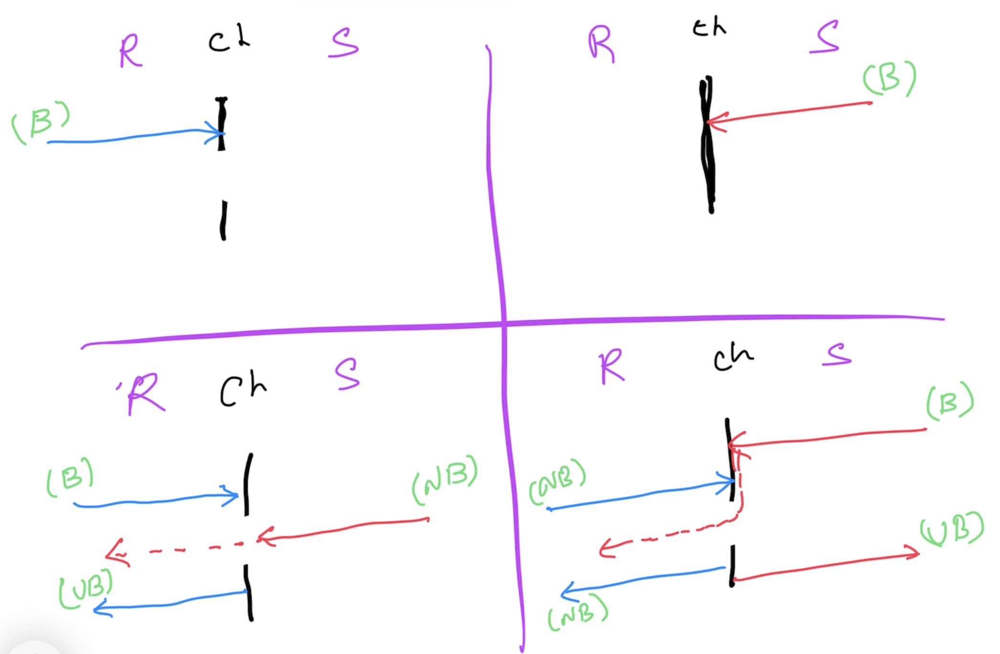

# Go Intermediate

## Magesh Kuppan
- tkmagesh77@gmail.com

## Schedule
|       | Duration |
|-------|----------|
| Session-01 | 1:50 hrs |
| Tea Break | 20 mins |
| Session-02 | 1:50 mins |

## Software Requirements
- Go tools (https://go.dev/dl)
- Any Editor
- Git Client

## Methodology
- No powerpoints
- Code & Discuss
- No dedicated Q & A time

## Repository
- https://github.com/tkmagesh/nutanix-gointermediate-aug-2024-2

## Prerequisites
- Data Types, Variables, Constants, iota
- Programming Constructs (if else, for, switch case)
- Functions
    - Higher Order Functions
    - Deferred Functions
- Errors
- Panic & Recovery
- Structs & Methods
    - Struct Composition
- Interfaces
- Modules & Packages

## Agenda
- Concurrency
- Concurrency Patterns
- IO
- Testing
- Database Programming
- HTTP Services

## Concurrency Programming
- Concurrency is NOT parallelism
- Application with more than one execution path
- Typically achieved using OS Threads
- OS Threads are costly
    - ~2MB 
    - Creating & Destroying (Thread Pools)
    - Context switch
## Go Concurrency
- Builtin scheduler
- Concurrent operations are represented as goroutines
- Goroutines are cheap (~4KB)
- Context switches are fast

- Concurrency support is built in the language
    - go keyword, channel data type, channel operator ( <- ), range & select-case constructs

### WaitGroup
- semaphore based counter
- can block the execution of the current function until the counter becomes 0

## Detecting Data Races
```
go run --race [filename.go]
```
```
go build --race [filename.go]
```

## Channels 
- share memory by communicating
- data type designed to enable communication between goroutines
### Declaration
```go
var [var_name] chan [data_type]
// ex:
var ch chan int
```
### Initialization
```go
[var_name] = make(chan [data_type])
// ex:
ch = make(chan int)
```
### Declaration & Initialization
```go
var ch chan int = make(chan int)
// OR (type inference)
var ch = make(chan int)
// OR
ch := make(chan int)
```
#### Channel Operations
- using the channel operator ( <- )
##### Send Operation
```go
[chan_var_name] <- [data]
// ex:
ch <- 100
```
##### Receive Operation
```go
<- [chan_var_name]
// ex:
<- ch
// OR
data := <- ch
```
#### Channel behavior


## Context
- For cancellation propagation
- "context" package
    - context.Background()
        - Non cancellable context
        - used to create the top most context
    - context.WithCancel(parentCtx)
        - Cancellable context
        - Programmatic cancellation
    - context.WithTimeout(parentCtx, relativeTime)
        - Auto cancellation based on the relative time
        - Also allows programmatic cancellation
        - Wrapper for context.WithDeadline()
    - context.WithDeadline(parentCtx, absoluteTime)
        - Auto cancellation based on the absolute time
        - Also allows programmatic cancellation
    - context.WithValue(parentCtx, key, value)
        - Non cancellation
        - Used to share data across context hierarchy

## Database Programming
- database/sql
- sqlx
    - wrapper for database/sql
- code generators (ex: sqlc)
- ORM (ex: gorm)

## Testing
- gotest tool (https://github.com/rakyll/gotest)
- Mock generator (https://vektra.github.io/mockery/latest)

## Libraries & Frameworks
- https://github.com/avelino/awesome-go